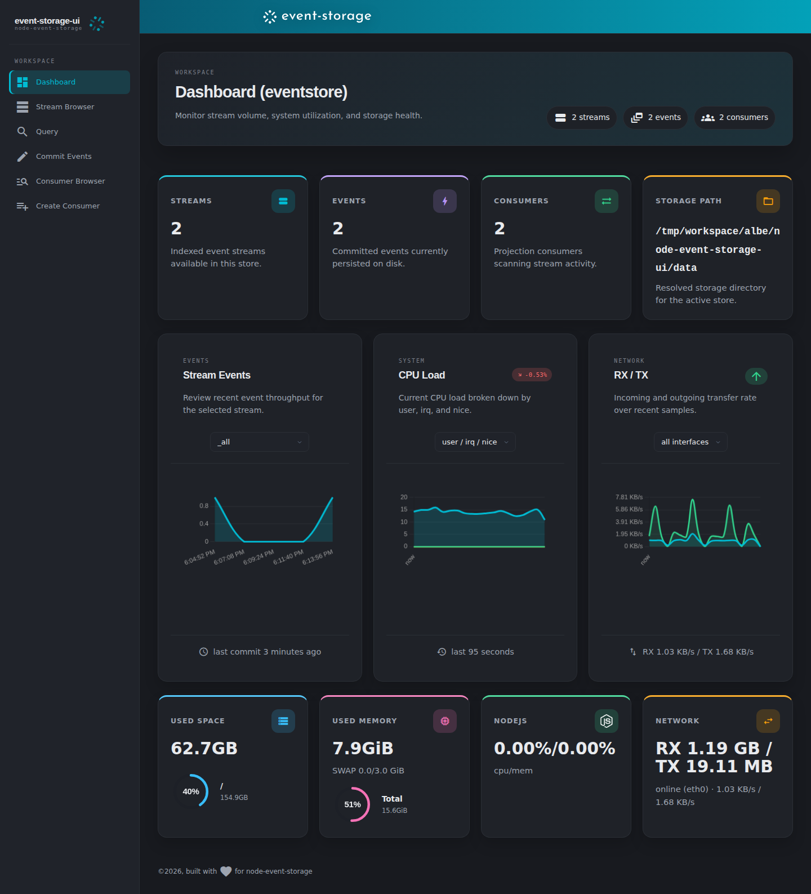
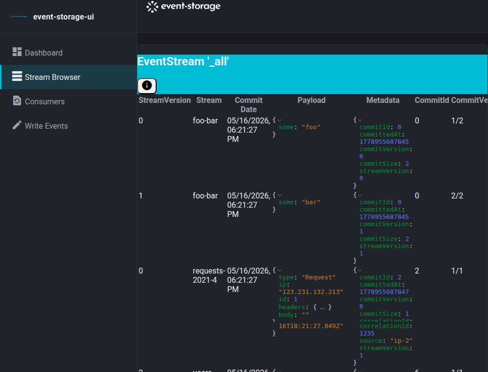
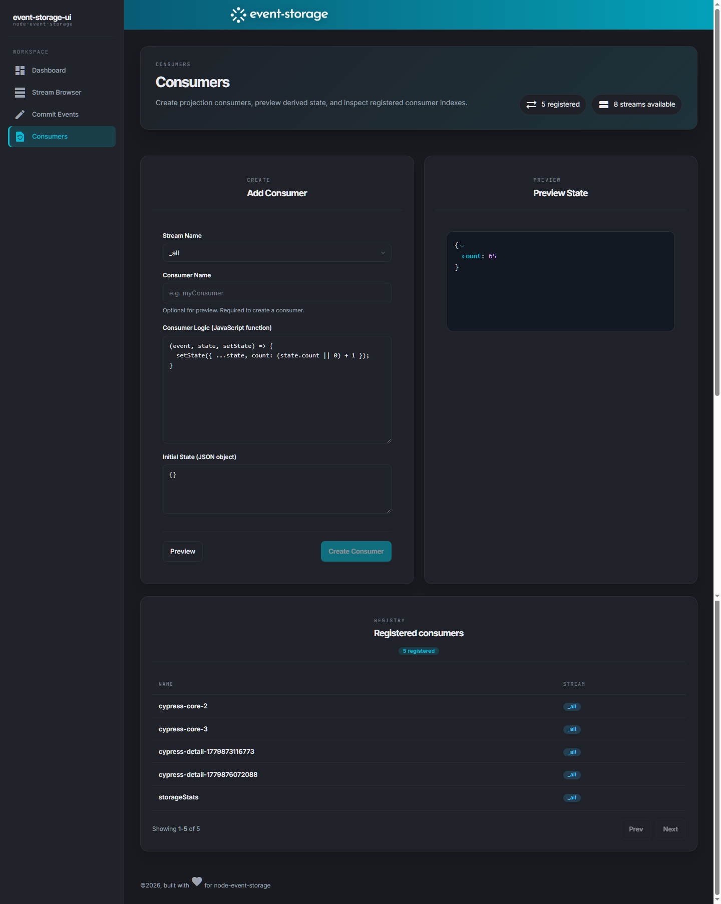
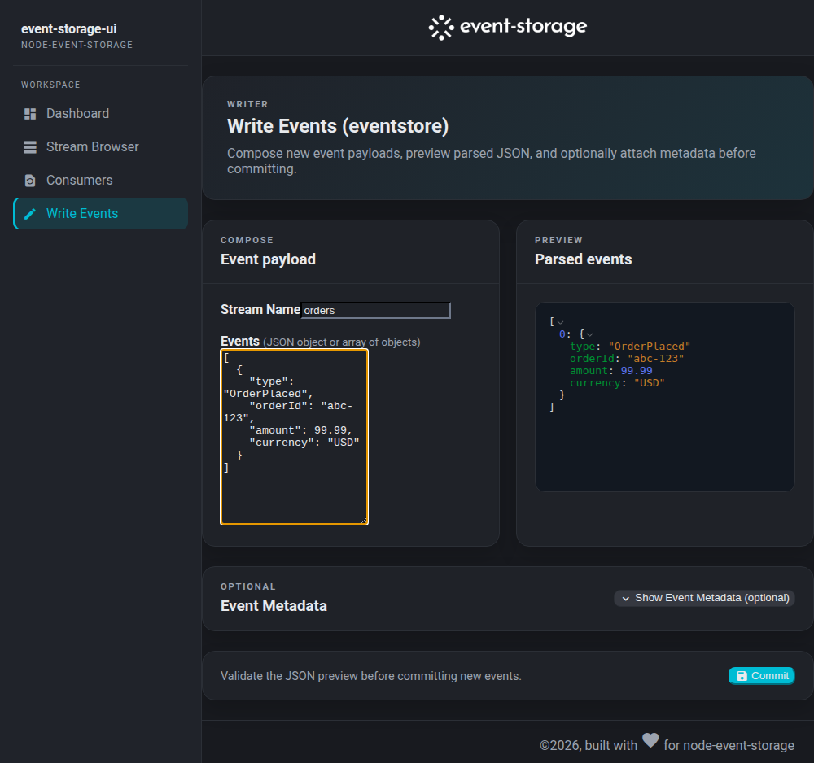

This is an admin dashboard for inspecting a running [node-event-storage](https://github.com/albe/node-event-storage) on the same machine. It is built using [Remix](https://remix.run/) with modern React and based on the [Adminator](https://github.com/puikinsh/Adminator-admin-dashboard) theme.

## Screenshots

### Dashboard



### Event Stream



### Consumers (create and list)



### Event commit/write



## Usage

```
git clone https://github.com/albe/node-event-storage-ui.git
cd node-event-storage-ui
npm install
npm run dev
```

or

```
npm run build && npm start
```
for creating a production build and running it. Make sure the webserver is not reachable from the public internet though.

To adjust the path to your local node-event-storage edit the `eventstore.config.json` file and adjust the `storeName` and `options.storageDirectory` JSON properties.
